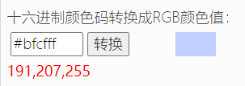

# 曦和 qq机器人

<img src="README.assets/xihe-%E6%AD%A3%E8%A7%86%E5%9B%BE-100.png" height="400" width="225" 

## 项目开始

为了解决Minecraft服务器远程不关机的需求，顺带能够检测服务器、服务端状态。且曦和ai的想法一早就有了，就用啦。先学学怎么做一个接受指令的bot。

## 发出信息

- 解耦，发出的信息放在信息区，方便更改，最好是读写文件来获取，json获取！！！！！
- 每一种信息一个 “信息类型.json”文件，放在xihe/message/     目录下

 

## 拟人设计

- 要设计人设啦，参考一波星尘

- 不强求要和人一模一样，有ai的特点，有人的特点

- - 参考以前给淘宝的人设，已经画出来的图可以参考
  - 目前找老同学设计

- 身高：160

- 三围：（得好好量量，说不定不准呢）

- 体重：45kg

- 出生日期：2021年8月13日（以前有很多，从想法起步、域名注册、找画师话人设，到qq机器人重构之前，算娘胎吧😝）

- 年龄：16岁（0岁）

- 发色：白发（散发） or 双马尾

- 代表色：#bfcfff     ，大致上对路，就是蓝色+紫色

## 想找个画曦和的画师

- 想给她找个画画的妈qaq 不然每次画都约稿没钱了qaq

 

## Q版表情包设计

- 设计一些萌萌哒的表情包给曦和用

- 包括：

- - 程序出错啦！
  - 不许欺负我！
  - 你输错啦！

 

## 开源与权利说明

- 曦和源码仅供研究学习使用，不允许商业使用（mirai框架限定）
- 曦和形象图、表情包等图片为自行定制图片，版权均归曦和和图作者所有，未经允许禁止在其他开源项目或者宣传等使用
- 用到 mirai     mirai-http-api miraicle项目，遵从以上项目的衍生开源协议
- （[xingyujie/flyos: Android geek tool      (github.com)](https://github.com/xingyujie/flyos)）看别人pull request看看这位小同学的python哪应该改，也确实学到了挺多QAQ

##  

## 后记

ps: 我是个学生啦，以前都是白嫖用别人的开源项目，frp，spigot啥的，感觉就很厉害！现在第一次完整做能用的项目，算是正个八经刚进新手村，各位大佬看到问题不妨指点一下错误qaq 让我经验条涨涨😙 看到issue 立马改

### 联系方式

| qq   | 784298357     |
| ---- | ------------- |
| 邮箱 | hailay@qq.com |
| q群  | 189594977     |

 

q群同时也在运行着公益的Minecraft服务器，从2017年开始开，这个机器人就是为了解决遇到的问题开发啦，可以进来一起玩233

